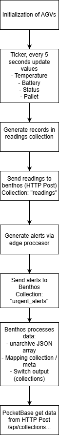

# Bento integration in IoT Template

## About

- ***A project that implements bento with data that comes from an external output `(MQTT)` for trasnform it to simplified data and uploaded to a IoT Template with a `PocketBase` database***

## Project Structure

`-> \api` 

 - (MQTT Service)

`-> \core`

 - (All functions and main files for the project )

`-> \data`

 - Location when data will be stored if DB is down

`-> \mqtt`

 - (MQTT Listener)

`-> \scripts`

 - (Scripts for testing the project)

`-> \tests`

 - (Automatic tests)

`.env` 

 - (Main variable configuration file)

`.env.example`

 - (Template variable configuration file)

`Dockerfile`

`docker-compose.yml`

`readme.md`

`requirements.txt`

`restart-docker.bat`

 - (File to build/rebuild the project in docker for Win)

`topic_errors.bat`

 - (File to connect to the Error topic in MQTT for Win)

`topic_alerts.bat`

 - (File to connect to the Alerts topic in MQTT for Win)

## Docker instalation

- ***To run the project you need Docker. Run this on your console:***

```bash
docker compose build --no-cache
docker compose up
```

- ***If youre in windows just run restart-docker.bat***

> As the DB is a template you need to modify some parts, you will need to activate the batch setting, create a collection called "`urgent_alerts`" and if you run the `script.go` grant access to create rule in collection "`readings`"

## Example of use:

**See the readme located in scripts folder**

- ***To use this project first run the Docker instalation, you will see the first test passed. now you need to run the Pocketbase db. Run the `send_random_mqtt.py` to see how readings records are created.***

## Principal classes:

`-> \api\service.py` 

- ***Initialize the program: Service class that initializes the MQTT listener and the batch writer. The MQTT listener will receive messages from the devices, enrich them with additional information (like the device_id and a timestamp) and send them to the batch writer, wich will handle the logic of sending the record to PocketBase, handling retries in case of failures, and sending failed record to an error topic in MQTT if they fail after the maximum number of retries.***

`-> \core\batch_writer.py`

- ***The BatchWriter class is responsible for managing the buffering and sending of records to PocketBase. It maintains a disk-based queue for persistence. It has a background thread that periodically flushes the buffer to PocketBase, and another thread that retries sending records from the disk queue in case of failures. It also handles retries with exponential backoff and sends failed records to an error MQTT topic if they exceed the maximum number of retries.***

`-> \core\pocketbase_client.py`

- ***A simple client to interact with the PocketBase API, handling authentication and requests. It includes a method to authenticate and obtain a token, a method to make POST requests that automatically re-authenticates if the token is expired, and a method to make GET requests.***

`-> \core\disk_queue.py`

- ***A simple disk-based queue implementation that allows us to store records in a file on disk. It provides methods to append records, load all records, count the number of records, rewrite the file with a new set of records, and clear the file. This is useful for our batch writer to have a persistent storage of the messages that need to be sent to PocketBase, allowing us to handle retries and ensure no data is lost in case of failures.***

`-> \core\edge-proccesor`

- ***Edge-proccesor or edge-computing its a "filter" layer for prevent errors on the AGVs, this class provide methos to check the values finding errors, like temperatures invalids (more than x, lees than x, negatives temperatures), same with battery, status and pallets sensors***

`-> \mqtt\listener.py`

- ***MQTT Listener module that connects to the MQTT broker, subscribes to the topic and listens for incoming messages from the devices.
When a message is received, it is parsed, enriched and sent to the batch writer for further processing and storage in the database. If there is an error in the payload or topic, the original message is sent to the errors topic with a reason for the failure.***

- ***With topic_errors.bat you can connect to the topic to listen when a packet fails in the process to upload to db***

## Data Flow

